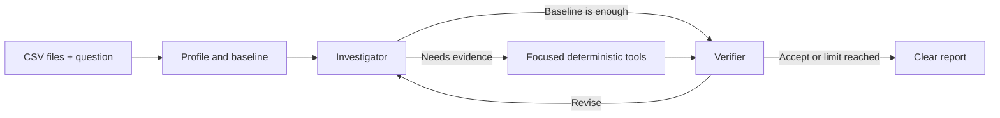

# ReconAI

**An evidence-controlled multi-agent investigator for related CSV datasets.**

ReconAI helps analysts find and explain disagreements between business datasets. Upload related
CSV files, ask a normal-language question, and receive a concise report with verified findings,
affected records, evidence references, and honest uncertainty.

Built with Python, CrewAI, pandas, Pydantic, Gradio, and OpenRouter.

## The problem

Reconciliation work is often slow and error-prone: analysts compare row counts, missing IDs,
duplicates, values, dates, and business segments across multiple files. A language model alone can
also invent calculations or overstate a root cause.

ReconAI combines deterministic data analysis with multi-agent reasoning. Python calculates the
facts; agents decide what to investigate, challenge the proposed explanation, and communicate only
what the evidence supports.

## How it works

1. **Profile and baseline:** inspect schemas, infer shared keys and relationship grain, then run
   standard reconciliation checks.
2. **Investigator Agent:** interprets the question and requests focused follow-up evidence when the
   baseline is not enough.
3. **Verifier Agent:** independently checks whether the proposed conclusion is supported.
4. **Controller:** validates evidence references, limits retries, and returns an inconclusive result
   instead of an unsupported claim.

The Investigator and Verifier run on every investigation. When baseline evidence already answers
the question, the Investigator cites it without making unnecessary tool calls. Ambiguous or
multi-cause questions trigger only the focused follow-up tools needed.



## Where it can help

- Missing identifiers in either direction
- One-to-one and one-to-many relationships
- Exact duplicates versus valid repeated foreign keys
- Numeric or categorical differences for matching records
- Affected segments, date ranges, records, and measurable impact

Typical uses include financial reconciliation, inventory checks, CRM-to-billing validation, source-to-warehouse comparison, and migration quality checks.

ReconAI can work with previously unseen related CSV datasets when they contain enough shared structure to infer their relationships.

## Example use

Someone using ReconAI only needs to:

1. Upload two or more related CSV files, such as source and warehouse exports, invoices and
   payments, or customers and transactions.
2. Ask a normal question without choosing columns or tools.
3. Review the verified answer, affected-record table, supporting evidence, and any remaining
   uncertainty.

Example questions:

```text
Investigate why these datasets disagree and show the affected records.

Which IDs are missing from either file?

The row counts match, but the totals do not. What is causing the difference?
```

ReconAI profiles the uploaded files, infers likely shared keys and relationships, selects the
relevant checks, and produces a readable analyst report. It does not require the user to know a
benchmark dataset or describe one-to-many behavior in the question.

## Reliability

- Important facts come from deterministic pandas tools, not model arithmetic.
- Every reported finding is tied to an evidence ID.
- Multi-cause reconciliations show a signed accounting bridge from one-sided keys,
  extra exact copies, and shared-key differences to the verified net total.
- Verification, bounded retries, and safe inconclusive results reduce unsupported conclusions.

## Evaluation in brief

ReconAI was checked with automated tests and two public-data evaluation styles:

- **51/51 automated tests** passed for the tools, workflow, evidence controls, and report output.
- **2/2 TPC-H agentic cases** passed: one required explaining multiple offsetting data problems;
  the other required finding which category contained a numeric discrepancy.
- **1/1 Olist relationship case** passed: the system found a missing related record without
  incorrectly treating valid one-to-many payment rows as duplicates.

These evaluations check whether both agents run, whether the correct deterministic tools are used,
and whether the final answer matches the evidence. Dataset names and expected answers are not
hardcoded into the investigation logic. Results are encouraging for a portfolio MVP, but free-model
availability and output consistency can vary between runs.

See [evaluation details](evals/README.md) for benchmark setup and commands.

## Run locally with `uv`

Requirements: Python 3.11–3.13, [uv](https://docs.astral.sh/uv/), an OpenRouter API key, and a
tool-capable model.

```powershell
cd "C:\path\to\reconai"
uv python install 3.12
uv sync --python 3.12 --group dev
Copy-Item .env.example .env
```

Set these values in `.env`:

```env
OPENROUTER_API_KEY=your_openrouter_api_key_here
OPENROUTER_MODEL=openrouter/free
OPENROUTER_BASE_URL=https://openrouter.ai/api/v1
```

Run the interface and open the local address shown in PowerShell:

```powershell
uv run python app.py
```

Run the automated tests without an API key:

```powershell
uv run pytest
```

## Limitations

- CSV input only, up to 50 MB per file
- Exact key matching; no fuzzy entity resolution or automatic currency/unit conversion
- Relationship inference requires meaningful columns and observable key patterns
- CSV evidence can identify a data-level cause but cannot prove an application or pipeline failure
- Agent performance depends on the configured model and provider

ReconAI is a tested portfolio MVP, not a production incident-management platform.
