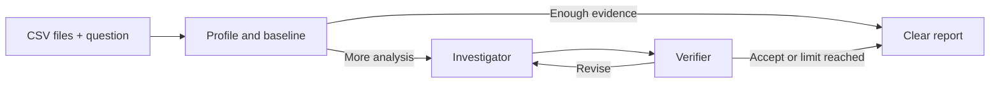

# ReconAI

**An evidence-controlled multi-agent investigator for related CSV datasets.**

ReconAI helps analysts find and explain disagreements between business datasets. Upload related
CSV files, ask a normal-language question, and receive a concise report with verified findings,
affected records, evidence references, and honest uncertainty.

Built with Python, CrewAI, pandas, Pydantic, Gradio, and OpenRouter.

## The problem

Reconciliation work is often slow and error-prone: analysts compare row counts, missing IDs,
duplicates, values, dates, and business segments across multiple files. A language model alone can
also invent calculations or overstate a root cause.

ReconAI combines deterministic data analysis with multi-agent reasoning. Python calculates the
facts; agents decide what to investigate, challenge the proposed explanation, and communicate only
what the evidence supports.

## How it works

1. **Profile and baseline:** inspect schemas, infer shared keys and relationship grain, then run
   standard reconciliation checks.
2. **Investigator Agent:** interprets the question and requests focused follow-up evidence when the
   baseline is not enough.
3. **Verifier Agent:** independently checks whether the proposed conclusion is supported.
4. **Controller:** validates evidence references, limits retries, and returns an inconclusive result
   instead of an unsupported claim.

Simple cases can finish from deterministic evidence. Ambiguous or multi-cause questions activate
the Investigator and Verifier.



## What it can investigate

- Missing identifiers in either direction
- One-to-one and one-to-many relationships
- Exact duplicates versus valid repeated foreign keys
- Numeric or categorical differences for matching records
- Affected segments, date ranges, records, and measurable impact

Typical uses include financial reconciliation, inventory checks, CRM-to-billing validation,
source-to-warehouse comparison, and migration quality checks.

## Example

```text
Investigate why these datasets disagree and show the affected records.
```

With the public Olist orders and payments datasets, ReconAI finds the single order ID with no
matching payment. It correctly treats split payments as a valid one-to-many relationship rather
than labeling them duplicate errors.

## Reliability and evaluation

- Important facts come from deterministic pandas tools, not model arithmetic.
- Every reported finding is tied to an evidence ID.
- Verification, bounded retries, and safe inconclusive results reduce unsupported conclusions.
- Current results: **43/43 automated tests**, **12/12 repeated deterministic benchmark runs**, and
  **2/2 agentic TPC-H cases** in the latest single-run evaluation.
- The agentic cases test two general behaviors: explaining offsetting missing/duplicate records and
  localizing a numeric discrepancy to the responsible category. No dataset name or expected answer
  is hardcoded into the investigation logic.
- Free-model availability and consistency can vary, so repeated agentic runs are still recommended
  before making production reliability claims.

See [evaluation details](evals/README.md) for benchmark setup and commands.

## Run locally with `uv`

Requirements: Python 3.11–3.13, [uv](https://docs.astral.sh/uv/), an OpenRouter API key, and a
tool-capable model.

```powershell
cd "C:\path\to\reconai"
uv python install 3.12
uv sync --python 3.12 --group dev
Copy-Item .env.example .env
```

Set these values in `.env`:

```env
OPENROUTER_API_KEY=your_openrouter_api_key_here
OPENROUTER_MODEL=your_tool_capable_model
OPENROUTER_BASE_URL=https://openrouter.ai/api/v1
```

Run the interface and open the local address shown in PowerShell:

```powershell
uv run python app.py
```

Run the automated tests without an API key:

```powershell
uv run pytest
```

## Limitations

- CSV input only, up to 50 MB per file
- Exact key matching; no fuzzy entity resolution or automatic currency/unit conversion
- Relationship inference requires meaningful columns and observable key patterns
- CSV evidence can identify a data-level cause but cannot prove an application or pipeline failure
- Agent performance depends on the configured model and provider

ReconAI is a tested portfolio MVP, not a production incident-management platform.
