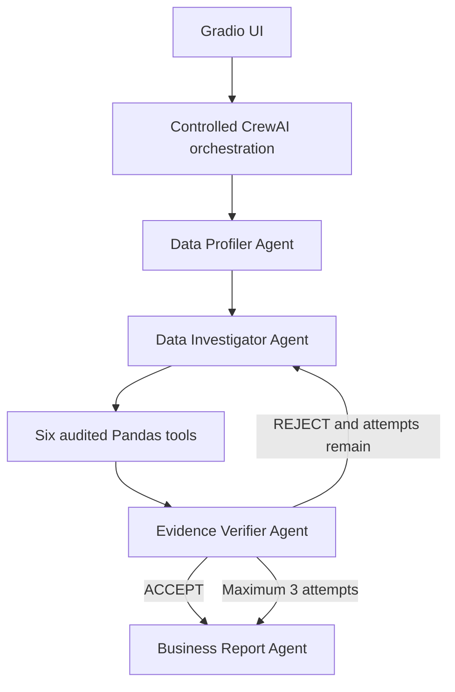

# ReconAI — Multi-Agent Data Incident Investigator

**A multi-agent AI system for enterprise data reconciliation and incident investigation.**

ReconAI accepts multiple CSV datasets and an investigation question, then uses four specialized CrewAI agents and six deterministic Pandas tools to build, challenge, and report an evidence-backed root-cause hypothesis. It is an investigation workflow—not a chatbot.

## Project Overview

Operational datasets often disagree because records are missing, duplicated, delayed, or represented differently across systems. ReconAI lets an AI investigator choose useful analytical checks while keeping every important numerical calculation inside bounded Python tools. An independent verifier can reject weak evidence and trigger up to two additional investigation attempts.

## Business Problem

When revenue, orders, payments, customers, or operational counts disagree, analysts must manually profile files, reconcile identifiers, isolate affected segments, locate the incident window, estimate directly measurable impact, and communicate uncertainty. ReconAI automates part of this process without allowing the language model to invent statistics or execute unrestricted Python.

## Architecture



The controller owns a Pydantic `InvestigationState`, preserves evidence across retries, blocks exact repeated tool calls, and enforces `MAX_INVESTIGATION_ATTEMPTS = 3`. CrewAI agents receive compact profiles and tool observations—not complete CSV contents.

## Agent Roles

1. **Data Profiler Agent** reviews deterministic dataset profiles, data-quality observations, possible keys, date columns, numeric columns, and conservative relationship candidates.
2. **Data Investigator Agent** is the main reasoning agent. It chooses analytical tools, observes their results, forms a hypothesis, identifies uncertainty, and changes direction after verifier feedback.
3. **Evidence Verifier Agent** independently accepts or rejects the hypothesis. It rejects unsupported causal language and returns specific missing-evidence requests.
4. **Business Report Agent** runs only after acceptance or the attempt limit. It writes a concise report with evidence IDs, supported impact, remediation ideas, and remaining uncertainty.

## Deterministic Tools

| Tool | Purpose |
|---|---|
| `profile_dataset` | Compact schema, row count, types, nulls, duplicates, cardinality, numeric summaries, likely IDs and dates |
| `compare_aggregates` | Compare `sum`, `count`, or `mean` across two datasets |
| `find_unmatched_records` | Reconcile a directional key relationship and return bounded identifier samples |
| `find_duplicates` | Detect duplicate full rows or duplicate selected keys |
| `segment_analysis` | Filter and aggregate by segment and/or time, including unmatched-only analysis |
| `calculate_business_impact` | Calculate affected count, percentage, exact available amount, date range, and top segment |

There is deliberately no `execute_python` tool. Invalid files, columns, aggregations, filters, and matching configurations return clear validation errors.

## Agentic Loop

```text
reason
  → choose a bounded tool
  → observe deterministic evidence
  → form a cautious hypothesis
  → verify independently
  → retry with a different angle when necessary
  → report after acceptance or three attempts
```

The visible investigation trace contains actions, tool observations, decisions, and verification outcomes. It does not expose hidden chain-of-thought.

The same safe operational trace is printed live in the terminal. It shows agent and task starts, LLM request status, bounded tool arguments, deterministic observations, verifier outcomes, retries, and completion. Prompts, model responses, hidden reasoning, full CSV rows, and API keys are deliberately omitted.

## Tech Stack

- Python 3.11+
- CrewAI
- Pandas
- Gradio
- Pydantic
- OpenRouter through CrewAI's OpenAI-compatible LLM interface
- python-dotenv
- pytest

## Setup

### Recommended: uv

```powershell
uv python install 3.12
uv sync --python 3.12 --group dev
Copy-Item .env.example .env
```

Run the application without manually activating the environment:

```powershell
uv run python scripts/generate_test_data.py
uv run python app.py
```

Run tests:

```powershell
uv run pytest
```

### Alternative: pip

Create and activate a virtual environment:

```bash
python -m venv .venv
```

Windows PowerShell:

```powershell
.\.venv\Scripts\Activate.ps1
```

macOS/Linux:

```bash
source .venv/bin/activate
```

Install dependencies:

```bash
pip install -r requirements.txt
```

Copy the placeholder environment file:

```powershell
Copy-Item .env.example .env
```

or:

```bash
cp .env.example .env
```

Edit `.env` and insert your own OpenRouter key:

```env
OPENROUTER_API_KEY=your_openrouter_api_key_here
OPENROUTER_MODEL=nvidia/nemotron-3-super-120b-a12b:free
OPENROUTER_BASE_URL=https://openrouter.ai/api/v1
```

No real key is included in this repository. Change only `OPENROUTER_MODEL` to select a different OpenRouter model. Authentication, rate-limit, provider-availability, and connection failures are converted to clear UI messages.

## Generate Demo Data

```bash
python scripts/generate_test_data.py
```

This creates several thousand deterministic records in `sample_data/`:

- `orders.csv`
- `payments.csv`
- `customers.csv`
- `ground_truth.json`

The ground-truth file is for tests and evaluation only. Do not upload it to ReconAI. The agents see only CSVs selected in the UI and must discover the incident through tools.

## Run

```bash
python app.py
```

Open the local Gradio URL, upload the three CSV files, and enter:

```text
Why does revenue in payments.csv not match orders.csv?
```

## Example Result

> **Illustrative output only. Exact values depend on the generated files and agent path.**
>
> **Investigation Status:** Evidence-supported hypothesis accepted  
> **Root Cause:** The discrepancy is strongly associated with captured payments whose order IDs are absent from `orders.csv`, concentrated in the Mobile channel after August 24.  
> **Confidence:** High  
> **Evidence:** Aggregate difference, directional unmatched-key count, unmatched segment distribution, time distribution, and exact affected-value calculation, each cited by evidence ID.  
> **Recommended remediation:** Reconcile missing order IDs from the source-of-record, inspect the Mobile ingestion path, backfill confirmed omissions, and add automated key reconciliation monitoring.

This wording intentionally describes an association unless uploaded data proves a causal mechanism.

## Testing

Run all deterministic and integration-style tests without an API key:

```bash
pytest -q
```

The suite independently checks all six tools, profiling, evidence preservation, rejection/retry transitions, successful reporting, the three-attempt limit, and mandatory inconclusive output. It does not assert nondeterministic LLM prose.

## Project Structure

```text
reconai/
├── app.py
├── requirements.txt
├── README.md
├── .env.example
├── src/
│   ├── agents/       # Exactly four agent factories, runtime, audited adapters
│   ├── tools/        # Six deterministic analytical tools
│   ├── flow/         # Bounded investigation controller
│   ├── config.py
│   ├── models.py
│   └── state.py
├── scripts/
│   └── generate_test_data.py
├── sample_data/
└── tests/
```

## Reliability and Security

- CSV-only validation with a 50 MB per-file MVP limit.
- Compact tool responses and samples capped at ten identifiers.
- No uploaded full dataset is placed into an LLM prompt.
- Important evidence is stored as structured Pydantic records with tool name, value, details, attempt, signature, and evidence ID.
- Exact repeated tool calls are blocked across retries.
- Uploaded filenames must be unique to avoid ambiguous agent tool calls.
- No API keys are printed, hardcoded, generated, or committed.
- An inconclusive result is preferred to an unsupported root-cause claim.
- Dataset-aware quality guidance ranks informative business dimensions and rejects constant fields as affected segments.
- The report is generated as validated structured data and rendered into a consistent investigator-friendly Markdown layout.

## Limitations

- CSV-only MVP; no database or SaaS connectors.
- Six intentionally limited analytical tools.
- LLM investigation paths and wording can vary.
- Findings are evidence-backed hypotheses, not guaranteed causal conclusions.
- Cross-file semantic mapping still depends on available column metadata.
- Free OpenRouter models may experience rate limits or temporary provider unavailability.

## Future Improvements

- SQL and managed database connectors.
- More advanced anomaly and schema-drift detection.
- A larger automated evaluation dataset and scoring harness.
- Human-in-the-loop remediation approval.
- Production observability, cost tracking, and trace export.
- Additional governed enterprise data sources.
